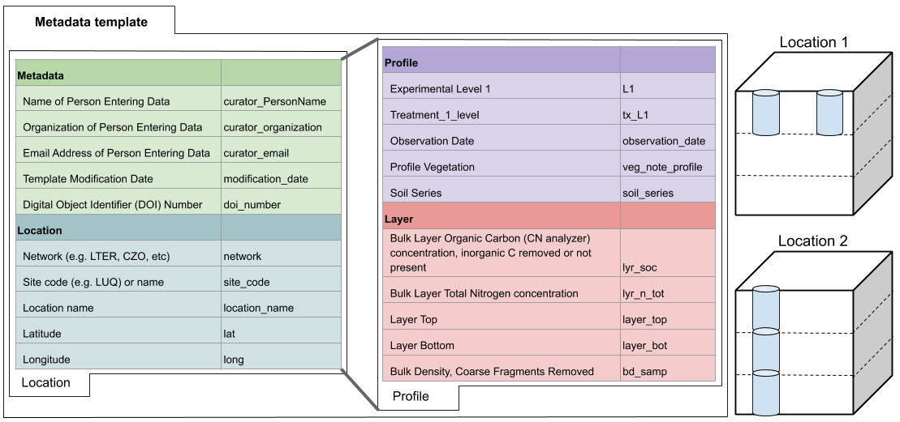

### Contributions
We welcome new data contributions, especially repeated measurements from long-term experiments. 

* Please see instructions provided [here](https://drive.google.com/file/d/1PCyhULsPMGNlKYgmqOTz7TKBXdC3tINJ/view?usp=sharing) for an overview of how to contribute data.

* Please see [here](https://docs.google.com/spreadsheets/d/1dUr1Vwds51u0SVeRm6O7CNcv_IHOsAySucWKQz4W28o/edit?usp=sharing) to access the SoDaH database template file (*note that you will need to copy the database template file to be able to edit it*).
  
#### Summary illustration of the hierarchical relationship between data fields in the SoDaH database
  

The metadata template is used to map information from individual studies with standardized variables names units that are used in the harmonized SoDaH dataset. Data contributors are asked to provide metadata and location data (on the `location` tab) as well as profile and layer information (on the `profile` tab). 

Data on the `location` tab represents site characteristics for a unique site or location (e.g., latitude, longitude, mean annual temperature from the Prospect Hill Warming experiment at Harvard Forest). 

Data on the `profile` tab includes profile information about experimental levels (e.g., plots within experimental blocks) and experimental treatments (e.g., +N fertilization) that help clarify how the data were collected. This also includes information collected across soil layer, which includes information on soil chemical and physical properties that may be measured on bulk soils for defined soil horizons or depth increments. All of the data on the profile tab should also correspond to columns of variables that are reported in the Level-0 data (e.g., soil organic C measured at different soil layers). 

After completing the metadata template data contributors of database maintainers will use the harmonization script to broadcasts data provided on the `location` tab to every row of the harmonized dataset. The harmonization script copies each unique measurement from the `profile` tab into a column of data in the Level-1 harmonized dataset. Data contributors, therefore, can move variables from the `location` to `profile` tabs when appropriate. For example, a gradient study that reports tabular data for individual soil profiles can move information on latitude, longitude, slope, aspect, vegetation communities or parent material (typically on the `location` tab) onto the `profile` tab of the metadata template, where appropriate.

* Please contact wwieder (at) ucar (dot) edu with questions and contributions. 
