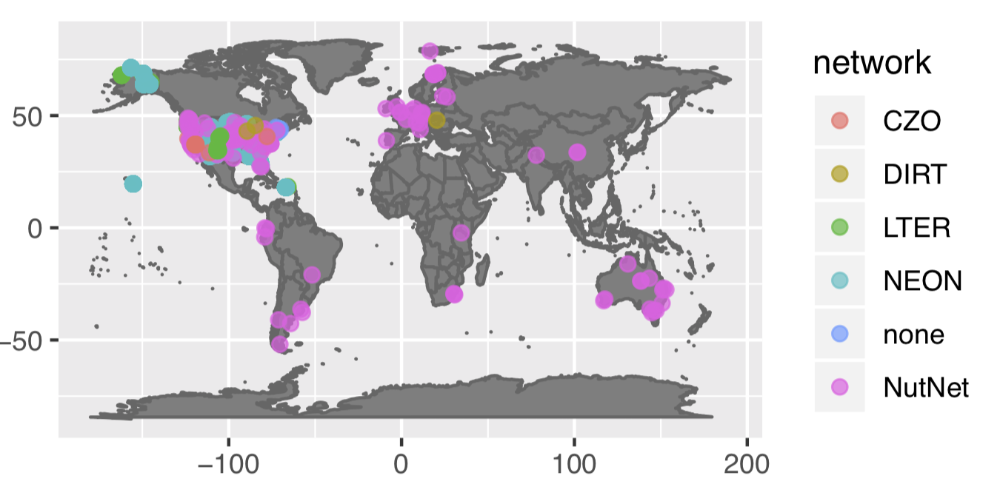

<!-- Start Writing Below in Markdown -->

### Progress
 
  To date we have data from >140 locations with >360,000 rows of information
  
### You can explore our data here [**Link to the Shiny app!**](https://cosima.nceas.ucsb.edu/lter-som/)

