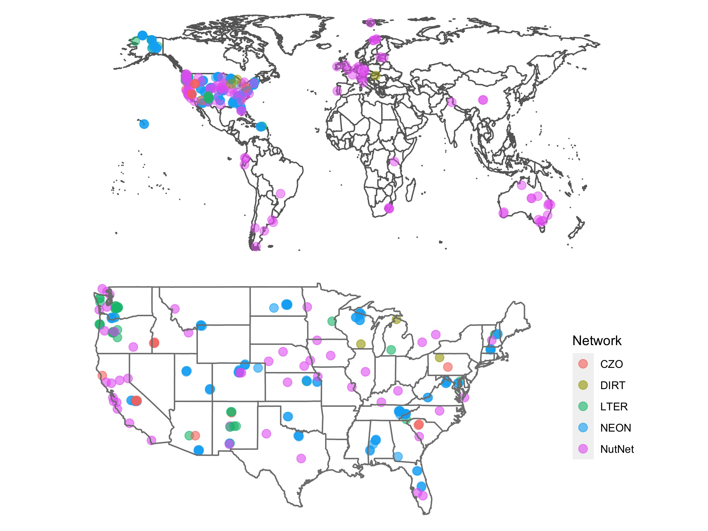

### [The SoDaH database is available at EDI!](https://doi.org/10.5194/essd-2020-195)
  - To date we have data from ~ 190 sites and 400 unique locations with >360,000 rows of information

### SoDaH database description is available in [_Earth System Science Data Discussions_](https://doi.org/10.5194/essd-2020-195)
 

### You can explore the current database using this [**Link to the SoDaH Shiny app**](https://cosima.nceas.ucsb.edu/lter-som/)
 

#### Geographic coverage of sites in SoDaH

  

### Accessing the data
* You can explore the database interactively through our [shiny app](https://cosima.nceas.ucsb.edu/lter-som/).

* Access the [published dataset](https://portal.edirepository.org/nis/mapbrowse?scope=edi&identifier=521) available through the Environmental Data Initiative (EDI) data portal.

* Please be sure to cite the data using the citation information available through the EDI data portal at the link above. 