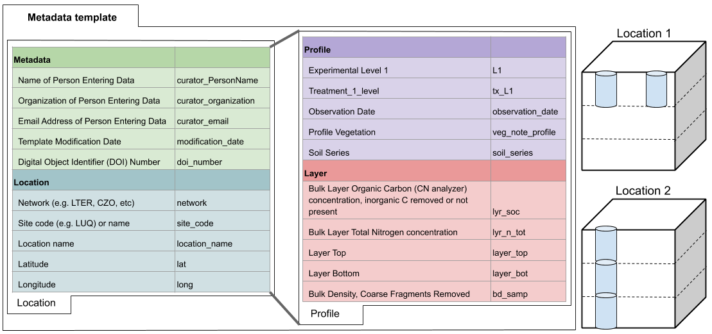

<!-- Start Writing Below in Markdown -->

### [The SoDaH database is available at EDI!](https://doi.org/10.5194/essd-2020-195)
  To date we have data from ~ 190 sites and 400 unique locations with >360,000 rows of information

### You can explore the current database here [**Link to the Shiny app!**](https://cosima.nceas.ucsb.edu/lter-som/)

#### This map shows data locations

  
### Contributions
  We welcome new data contributions, especially repeated measurements from long-term experiments. 

[**An overview of how to contriubte data is here**](https://drive.google.com/file/d/1PCyhULsPMGNlKYgmqOTz7TKBXdC3tINJ/view?usp=sharing)

[**The SoDaH database template file cound be found here**](https://docs.google.com/spreadsheets/d/1dUr1Vwds51u0SVeRm6O7CNcv_IHOsAySucWKQz4W28o/edit?usp=sharing)

*Note* you'll need to copy the database template file to be able to edit it.
  
Please contact wwieder (at) ucar (dot) edu with questions and contributions

#### Hierarchical relationship between data fields in the SoDaH database
  
