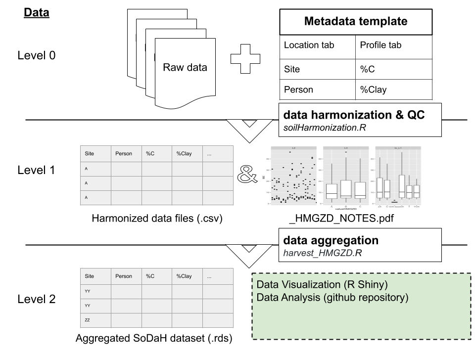
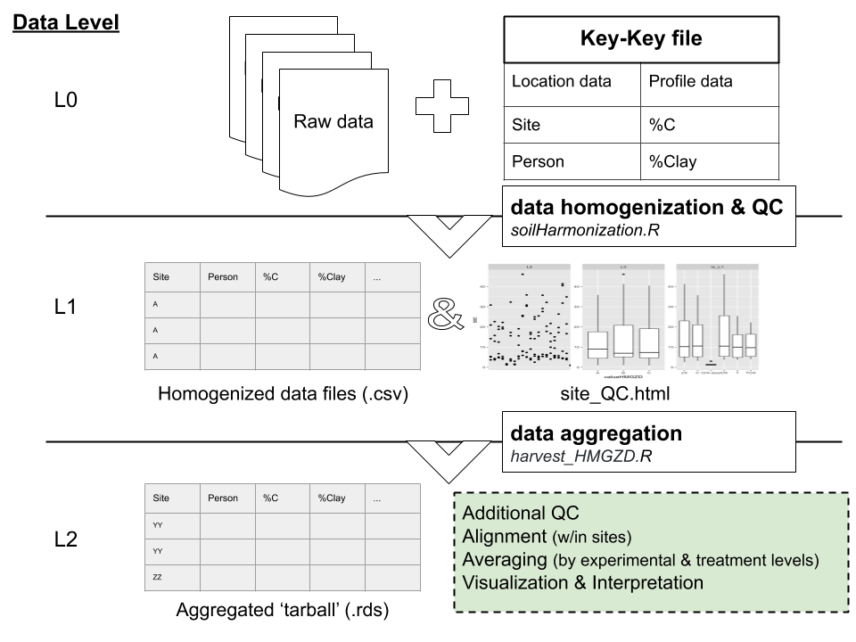

<!-- Start Writing Below in Markdown -->

### Our workflow: 

1) Harmonizes raw data into a common format; 
2) Aggregates data into an R object;
3) Data visualization and interpretation tools (Shiny app);
4) Data analysis and summary scripts.

<<<<<<< HEAD
### The schematic below illustrates our workflow

=======

>>>>>>> 17a0caaf8a53f13f0470f588f318174ada1a6830

~ 

### Data harmonization

Instruction for using the soilHarmonization.R package [can be found here](https://github.com/lter/soilHarmonization).

### Data aggregation 

Location data are aggregated with [scripts](https://github.com/lter/lterwg-som/tree/master/data-aggregation) to harvest homogenized data from Google Drive.

### Data visualization

Query, visualize, and access the data using our [Shiny app](https://cosima.nceas.ucsb.edu/lter-som/).

### Data analysis 

Get the latest _SoDaH database_ using the using our [Shiny app](https://cosima.nceas.ucsb.edu/lter-som/) (recommended) or [with this script](https://github.com/lter/lterwg-som/blob/master/data-processing/get_latest_som.R)
